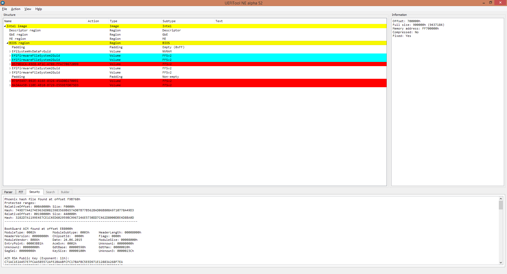

# Defeating a Laptop's BIOS Password

We found a laptop laying around the office that had BIOS password enabled. On top
of that, the laptop had secure boot turned on. We wanted to run an OS that was not signed with Microsoft's keys, so
we really needed a way to get into the setup utility.

Some minor details have been changed to obfuscate the manufacturer and the model of the target laptop.

## Table of Contents

* [Table of Contents](#table-of-contents)
* [UEFI Primer](#uefi-primer)
	* [Glossary](#glossary)
	* [The Boot Process](#the-boot-process)
	* [Firmware Filesystem](#firmware-filesystem)
* [Flash Black Magic](#flash-black-magic)
	* [Dumping the Flash](#dumping-the-flash)
	* [Parsing the Flash](#parsing-the-flash)
	* [Messing with NVRAM](#messing-with-nvram)
* [Breaking and Entering](#breaking-and-entering)
	* [Loading into Setup](#loading-into-setup)
	* [Modifying Firmware In-Memory](#modifying-firmware-in-memory)
* [GUID Hell](#guid-hell)
	* [Emulated EEPROM](#emulated-eeprom)
	* [Boot-Time Shenanigans](#boot-time-shenanigans)
	* ["The Incident"](#the-incident)
* [Enabling JTAG](#enabling-jtag)
	* [Locating the Options](#locating-the-options)
	* [Editing NVRAM Variables in Flash](#editing-nvram-variables-in-flash)
* [Fixing "The Incident"](#fixing-the-incident)
	* [Orienting Ourselves](#orienting-ourselves)
	* [Executing Code](#executing-code)
* [Obligatory blurb](#obligatory-blurb)

## UEFI Primer

### Glossary

* SEC - Security
* PEI - Pre-EFI Initialization
* DXE - Driver eXecution Environment
* PEI module/DXE driver/UEFI application - Microsoft PE formatted files containing firmware code
* Protocol - An instance of a struct identified by a GUID
* PCH - Platform Controller Hub

### The Boot Process

Even today's modern 64-bit CPUs begin execution in 16-bit mode. In UEFI, this is called the SEC phase. The SEC phase
configures a minimal set of CPU registers and then switches the CPU into 32-bit mode. This mode switch marks
the end of the SEC phase and the beginning of the PEI phase. In þe days of olde the SEC phase also acted as the root of
trust for the system, but nowadays that role is assigned to the PCH. The PCH verifies the firmware for the SEC and
PEI phases before the CPU begins executing any code. The PEI phase configures some non-CPU platform components and
optionally verifies the integrity of the DXE phase's code. After verification, the PEI phase switches the CPU
into 64-bit mode and starts the DXE phase. The DXE phase contains all of the drivers and applications that run before
your OS boots, including your OS's bootloader. Some of these drivers persist even after your OS has booted.

### Firmware Filesystem

UEFI defines its own filesystem format for use in flash images. A flash image will contain one or more firmware
volumes, and each volume will contain one or more firmware files. Files are identified by a GUID rather than by a name,
although some file types define a way to optionally provide a name. A file can also be a container for another volume,
which enables nested volumes (i.e. one volume within another). Nested volumes are commonly used to support volume
compression.

## Flash Black Magic

### Dumping the Flash

At heart, PCs are just large, powerful, embedded devices—and like most embedded devices they have flash chips that we
can dump and rewrite. The flash chip is usually the chip with the bulkiest package on the board. We quickly identified
the flash chip on our laptop's motherboard, and promptly attached it to a SPI flash programmer with some clips.


### Parsing the Flash

The flash's contents were formatted as an Intel image and could readily be parsed by [UEFITool](https://github.com/LongSoft/UEFITool)



Intel flash images are divided into several regions. However the only region that we cared about was
the BIOS region. The BIOS region consists of several firmware filesystem volumes and an NVRAM variable storage area. We
could have just found the file responsible for showing the setup screen to the user and patched out the password
check, but that wasn't possible on this laptop because hardware-based firmware security was enabled.

In the image above, areas marked in red are protected by Intel BootGuard. Before the CPU can execute any instructions
the hash of the red areas is computed and then checked against a signature stored in the flash somewhere; the hash of
the RSA public key used to verify that signature is fused into the PCH during the OEM's manufacturing process. The
areas marked in cyan are protected by the OEM's code verification mechanism. The OEM has to implement it's own
verification mechanism on top of BootGuard, because BootGuard only protects the SEC and PEI phases. The DXE phase also
needs to be protected from modification. In most implementations, the cyan areas are hashed, and that hash is matched
against a hash stored in a file in the red area. Since everything in the red area is already protected by BootGuard,
another signature is not needed. However, no NVRAM variables can be protected because they're designed to be modified
by end-users.

### Messing with NVRAM

None of us had ever seen the secure boot enable flag or the BIOS password stored anywhere except inside of
an NVRAM variable. So the first
thing that we wanted to try was completely clearing all of the NVRAM variables and having the board use its default
values for everything. If we were lucky, secure boot would be disabled and the BIOS password would be gone. However,
when we tried to boot the board after clearing the variable store, we were presented with the following error message:

```
12B4: Bad Checksum of Sec Settings in NVRAM variable.
```

We searched for a portion of that string in the dump, and then loaded the DXE driver containing it into IDA. Once it
was loaded, we followed the x-refs to reach the code that referenced it. It seemed like it would attempt to get a
handle to a protocol with a certain GUID, and if it was not able to, it would get a handle to the logging protocol and
send it that error message. We tracked down the driver that implemented the desiered protocol and
looked at all of the NVRAM variables it attempted to access. One of them had `SecConfig` in its name, so we tried
clearing all NVRAM variables except for that one and hoped for the best. The board booted successfully and secure boot
was disabled, :D! The BIOS password, however, was still enabled... :(. It couldn't have been stored in the `SecConfig`
variable, because after looking at its contents we determined that it was just a bunch of enable/disable flags. There
was not enough data in the variable to contain either the password itself or the hash of the password. From these
findings, we concluded that the BIOS password had to be stored somewhere other than NVRAM, and that it could have even
been stored off-flash on an entirely different chip.

## Breaking and Entering

### Loading into Setup

It was possible to return to the boot device selection menu after you had booted into a flash drive by exiting the UEFI
app that was running (in this case a copy of the UEFI shell). However, when this was done the option to enter the setup
menu from within the boot menu would disappear. We looked at the NVRAM boot entry for the setup menu and saw that it
was booting into a UEFI app with a GUID of `2AD48FB3-2E28-42F2-88D5-A73EC922DCBA`. By searching for that GUID in
UEFITool, we found the app's executable in the firmware.  We extracted it and put it on our flash drive. We tried
executing the app from within our shell, but for some reason the executable was marked as a DXE driver instead of a
UEFI app. We managed to get it to execute by using the `load` command instead of running it directly, but even when
we started it that way we were presented with the password prompt.

### Modifying Firmware In-Memory

We wanted to track down the driver that handled the password checking logic so that we could patch it in memory.
The patch we wanted to make would make it think that no password was set. It wouldn't be a permanent fix, but if it worked it would allow us to get
into the setup menu. With nothing else to go on, we looked through the names of all of the DXEs in the firmware image.
One that stood out to us was `BpwManager` because we thought that Bpw might have been short for BIOS password. We
loaded it into IDA, and then looked at all of its strings. We knew we had the right driver when we saw
`12AE: Sys Security - BIOS password entry failure count exceeded` in the string list. The driver registered one
protocol which consisted of several function pointers. We looked at all of the places that the setup utility used that
protocol and found one place where we believed that it was determining whether or not a BIOS password was enabled. It
called one of the functions provided by the protocol, and if the return value had its lowest bit set, it would do
something with the string `Enabled`, otherwise it would do something with the string `Disabled`.

```c++
((void (__fastcall *)(BpwProtocol *, _QWORD, char *))bpwProtocol->GetBPWFlags)(bpwProtocol, 0i64, &bpwFlags);
v13 = L"Enabled";
if ( !(bpwFlags & 1) )
	v13 = L"Disabled";
```

We assumed this was related to the code for displaying the menu entry for the BIOS password, and that the function it
was calling was some sort of `GetFlags()` function. The code for that function just read in a value from a memory
address and returned it. We used our UEFI shell to edit the flag value in memory and set it to 0, and then we tried
loading the setup utility again. It worked! We were even able to go to the security tab and unset/reset the BIOS
password! Sadly, after we rebooted the laptop and tried to enter the setup utility normally, it still prompted us for
the old password :(. Something weird was going on.

## GUID Hell

### Emulated EEPROM

Almost every function in the `BpwManager` driver called into a protocol with a GUID of
`9FFA2362-7344-48AA-8208-4F7985A71B51`. We used UEFITool's search by GUID function to find all references to that
protocol. One result in particular piqued our interest, it was a driver named `EmuSecEepromDxe`. We loaded it into IDA
and confirmed that this was the driver registering the protocol in question. The protocol consisted of three
function pointers, one of which did nothing except just return an error value. Based on the Hex-Rays output of the two
remaining functions and how they were used in the `BpwManager` driver, we constructed this structure to describe the
protocol:


```c++
struct EmuSecEepromProtocol
{
    public:
        EFI_STATUS (*eepromRead)(EmuSecEepromProtocol *this, __int64 eepromBankID, __int64 byteIndex, unsigned char *b);
        EFI_STATUS (*eepromWrite)(EmuSecEepromProtocol *this, __int64 eepromBankID, __int64 byteIndex, unsigned char b);
        EFI_STATUS (*returnError)();
};
```

We determined that the emulated EEPROM was divided into several sections, which we called banks. There were 8 banks,
containing 0x80 bytes each. Every `eepromBankID` referred to two continuous banks, with the second one being used for
byte indices above 0x80. We determined that the information that was important to the `BpwManager` DXE was stored in
bank ID 0x57.

We wrote a quick UEFI app to try and read out all 0x100 bytes from that bank ID, but every call we made to `eepromRead`
returned an error code for the first 0x80 bytes. That meant we were unable to read data from the first bank in
the group of two. We tracked down where that error number was referenced in IDA. Reading through the code, we
discovered that bank ID 0x5C was an array of access permissions for all of the banks. Every time something tried to
read or write from a bank, it would check a byte in bank ID 0x5C based on the bank number (not ID number) being
accessed. Bank ID 0x57 corresponded to bank numbers 6 and 7, and sure enough bank number 6 had permissions set
to not allow reads or writes and bank number 7 allowed reads. This explained why we were able to read bytes from the
second half but not from the first.

We attempted to change the permission byte of bank number 6, but that gave us another error. We discovered that there
was another bit in the permission byte that locked out further permission changes. We also tried patching out the jump
instructions that lead to the error return code, but that didn't work either. Now we knew that the check was also
happening somewhere outside of the driver. To track it down, we followed the path of all of the read/write requests and
found that they eventually ended up at the CPU IO EFI protocol. The actual operations were happening
off-CPU somewhere.

### Boot-Time Shenanigans

We guessed that all emulated EEPROM operations were actually being handled by the embedded controller, but we didn't
spend that much time searching for what was actually handling them; it was not that important for us to know. Almost
every other chip on the board was in a BGA package that we didn't know the pinout for, so it would
have been impractical to dump or reflash whatever chip it was stored on.

We knew at some point during boot, the permissions had to be set to allow at least some operations, because the prompt
asking you to type the password needed something to compare against and the setup utility had to have the ability to
change the password. The hint that we needed was that the setup button would still be present in the boot menu if you
booted into a built-in app such as the diagnostics splash screen, then exited it. However, like
we noted earlier, if you booted into an external app, such as a UEFI shell on a flash drive, the "Enter Setup" button
would disappear until the next reboot. We searched the dump for the names of one of the built-in apps to try and see if
we could redirect it to the normally inaccessible, but built-in, UEFI shell. It turns out they're completely standard
NVRAM UEFI boot entries. The attributes field of boot entries has a flag that means it's for an application, and
instead of a path to a file to run, the variable contains the GUID of a built-in app. We modified one of these boot
entries to point to the built-in shell, and then tried booting into it. It worked, and now we were in business!

### "The Incident"

We read out the permission bytes for all of the banks and saw that they allowed all permissions on every bank. We then
identified where the hash of the password was located within the EEPROM and wrote 0s to it. One of us had remembered
seeing that if the `BpwManager` read all 0s for the password's hash, it would think that no password was set. Turns
out, we were wrong. Really wrong. When we rebooted we were able to get into the boot menu, but choosing any boot entry
was met with this error:

```
01240: Bad BPW data, stop boot.
```

The error was only displayed for around 3 seconds, after which the system immediately powered off. Instead of patching the
hash directly in the emulated EEPROM, we really should have done the same patch we did before to bypass the password
prompt to get into the setup menu and changed it from there. Hindsight is 20/20. We were a little too
excited about all of the permissions being enabled.

## Enabling JTAG

At this point, the only way any of us could think of to save the board was JTAG. Even though the board had no JTAG
connector, most Intel chipsets support JTAG-over-USB. They call it direct connect interface, or DCI, and there are two
flavors: DbC (USB **D**e**b**ug**C**lass) and OOB (out-of-band). OOB implements a completely different wire protocol
on the USB pins and requires a special adapter that you can only get by signing an NDA with Intel. That left DbC; it's
like USB On-the-Go but in reverse. You use a crossover USB 3.0 A-A cable to connect to the board you're trying to
debug, and it will enumerate as a USB device. To interface with that USB device, you can use Intel System Studio, which
can be downloaded for free without an NDA. It gives you a normal-ish debugger interface.

### Locating the Options

We needed to figure out how to enable DCI. On most motherboards, the setup utility you can access only shows a small
subset of the available cofiguration options. For some reason, the other options are usually still compiled-in, even
though they'll always be hidden. Almost every interface you see in UEFI is based off of what the specification calls HII, or human
interface infrastructure. HII interfaces are designed in a language called VFR (visual form representation), and are
compiled into IFR (intermediate form representation). All we needed to do was find the DXE that displayed the options,
and then extract the IFR from it. Once we had the IFR we could disassemble it to make it human readable. Fortunately
for us, someone had already done the hard work of writing a tool to do all of those things. We used
[LongSoft's fork of Universal-IFR-Extractor](https://github.com/LongSoft/Universal-IFR-Extractor). To find the correct
DXE, we just searched for the name of one of the options in the setup utility. The output of the IFR extractor is a
disassembled version of the bytecode, but it's still easy enough to understand. There are a number of `VarStore`
objects defined like:

```
VarStoreEFI: VarStoreId: 0x5 [8D6355D7-9BD1-44FF-B02F-925BA85A0FAC], Attrubutes: 3, Size: 572, Name: PchSetup
```

Each `VarStore` corresponds to an NVRAM variable, given by its name and guid. The ID is used to reference it in
options. Options are defined like:

```
One Of: DCI enable (HDCIEN), VarStoreInfo (VarOffset/VarName): 0x8, VarStore: 0x5, QuestionId: 0x2D8, Size: 1, Min: 0x0, Max 0x1, Step: 0x0
	One Of Option: Disabled, Value (8 bit): 0x0 (default)
	One Of Option: Enabled, Value (8 bit): 0x1
End One Of {29 02}
```

The DCI enable option is stored in `VarStore` 5 at byte offset 8 and is 1 byte long. Setting that byte to 0 means
disabled, and setting it to 1 means enabled. These are all of the options that we changed:

* DCI enable (HDCIEN) -> Enabled
* Debug Interface -> Enabled
* Debug Interface Lock -> Disabled
* Enable/Disable IED(Intel Enhanced Debug) -> Enabled

### Editing NVRAM Variables in Flash

At this point since we were unable to boot into anything except the boot menu, our only option for editing those NVRAM
variables was to write to them directly using our external flash programmer. We retrieved a fresh dump from the flash chip so we would only
modify the current state rather than revert it to an earlier state and potentially cause even more things to break. We
found the offsets of the variables in the flash using UEFITool. There is a header on each variable, so you need to skip
past it to get to the actual value of the variable. After editing all of the variables thqat were needed to change the options, we reloaded the
dump in UEFITool to verify that we didn't accidentally corrupt anything and that the value of the variables actually
changed. After that, we re-flashed it, hooked up the crossover cable, powered-on the board, and hoped for the best.


Luckily enough for us, it worked! This was our first time getting JTAG on an Intel-based computer, and it was very
exciting—especially given how easy it turned out to be.

## Fixing "The Incident"

### Orienting Ourselves

We booted into the boot menu and then broke into the debugger. We had no idea what portion of code we had broken into, much
less where any of the code or data that we were interested in was located. Unfortunately, we hadn't thought to save the
load addresses of any of the relevant DXE modules before "the incident" occured and made the board unbootable, so we
had nothing to go on. The debugger had a built-in command that would list all of the loaded DXE modules, however it
needed the address of the UEFI system table, and the automatic scan for it failed.

In most UEFI binaries built using EDK-II, the system table gets stored in a global variable when the driver/app's
entry point function executes. We dumped a handful of bytes from the address RIP was at, and then searched for those
bytes in UEFITool to determine which module we were currently executing code in. We loaded that module into IDA and
rebased the database to the module's load address. We figured out the module's load address by searching the IDA
database for the bytes we pulled out earlier and computing an offset based on the value of RIP. Now that we had a
nicely aligned IDA database, we could easily obtain the address of the global variable that contained a pointer to the
system table. We retrieved the address of the system table from that variable, and supplied it to the debugger. Now,
when we gave it the command to list DXE modules it actually gave us a list. The output was similar to:

```
ModuleID  Base                Size        Name
00001     0x00000000D5A32000  0x00018460  <no_debug_info>
00002     0x00000000D5A4B000  0x00003B80  <no_debug_info>
00003     0x00000000D5A4F000  0x00001200  <no_debug_info>
00004     0x00000000D5A51000  0x00002F40  <no_debug_info>
00005     0x00000000D5A54000  0x00000540  <no_debug_info>
00006     0x00000000D5A55000  0x00001620  <no_debug_info>
...
```

Annoyingly, the debugger would not give us the module's name or even its GUID without debug info loaded. However, we
could use the size of the module to narrow down the list of possible base addresses. UEFITool provided the size of each
module. We examined the memory located at each of the remaining base addresses and compared it to the data that we
extracted from the firmware dump to figure out which base address corresponded to each module we were interested in.

### Executing Code

We pondered the best way to execute arbitrary code for a while. We realized that all of the code we would need to run
would cause a state change that would persist across reboots. That meant that we would not have to return execution to
the firmware; after our code had run we could just reboot the board.

We looked back at the code inside of `BpwManager`, and determined there was a two byte checksum that we hadn't erased.
We theorized that zeroing that checksum would allow the board to boot. To write the zeros, we simply set RIP to the
address of the `eepromWrite` function and set all other registers to supply the correct function arguments. We put a
breakpoint on the return instruction of the `eepromWrite` function so that execution would not return to firmware code.
Returning to firmware code probably would have caused a crash because by modifying the registers we put the board into
an undefined state. After overwriting the two bytes and resetting the board, the BIOS password was finally gone! We
tried setting our own password from the setup utility just to make sure that it was actually gone and we had full
control. That also worked.

## Obligatory blurb

Would you like to reverse engineer and exploit embedded systems? Ones that might even be able to fly? We're hiring! You
can view our current open positions at [https://www.skysafe.io/jobs](https://www.skysafe.io/jobs). If you don't see a
position that looks right for you, feel free to send us a resume. We may have openings that we're not actively hiring
for.

## Timeline

* 2019-11-14 - Sent email to vendor security contact. Vendor given a 90-day deadline.
* 2019-11-20 - No response to initial outreach. Sent another email to vendor and CC'd [UEFI USRT](https://uefi.org/security).
* 2019-11-20 - UEFI USRT acknowledged receipt of emails
* 2020-01-30 - Vendor replied and asked what our disclosure plans were.
* 2020-01-30 - We replied that we were planning on publishing our blog post publicly on 2020-02-12 and offered the vendor a 14-day extension. We included a draft copy of this blog post with this reply.
* 2020-02-01 - Vendor asked if we were able to reproduce the issues on any other products in the same product line.
* 2020-02-03 - We replied that we had not attempted to reproduce it on any other products, but all products that use the `EmuSecEeprom` driver may be vulnerable.
* 2020-02-04 - Vendor asked for more details on how the UEFI shell was launched.
* 2020-02-19 - We replied with an explanation of how the `EFI_LOAD_OPTION` struct works when the `LOAD_OPTION_CATEGORY_APP` attribute is set.
* 2020-02-20 - We let the vendor know that we were planning to publish the blog post on 2020-02-21.
* 2020-02-20 - The vendor said they had been able to reproduce most of the findings and were planning on issuing an advisory. They were having trouble reproducing one of the findings and asked for a full SPI flash image
* 2020-02-20 - We sent the vendor a full SPI flash image that demonstrated the issue.
* 2020-02-24 - Blog post published.