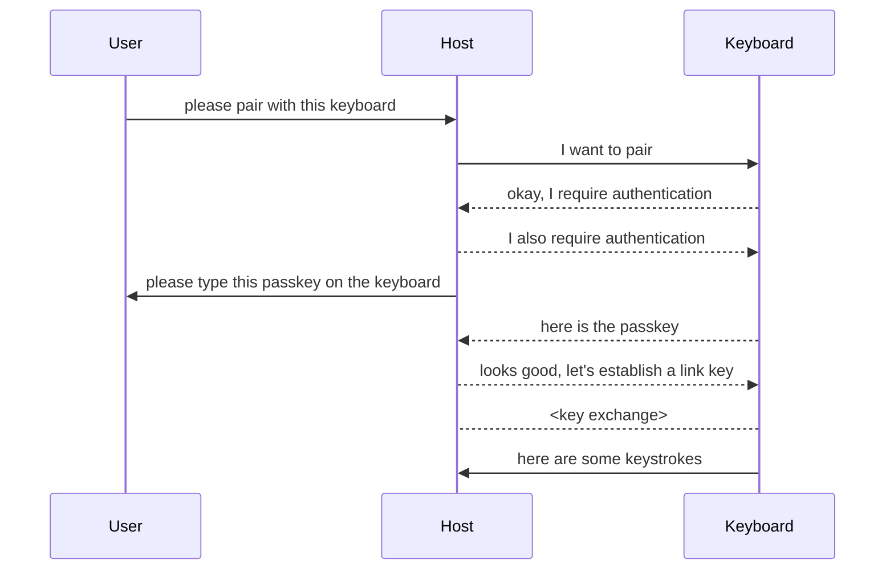
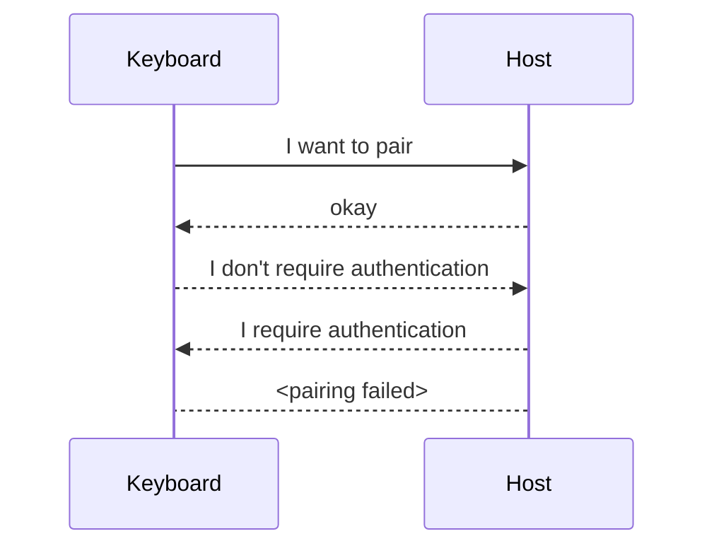
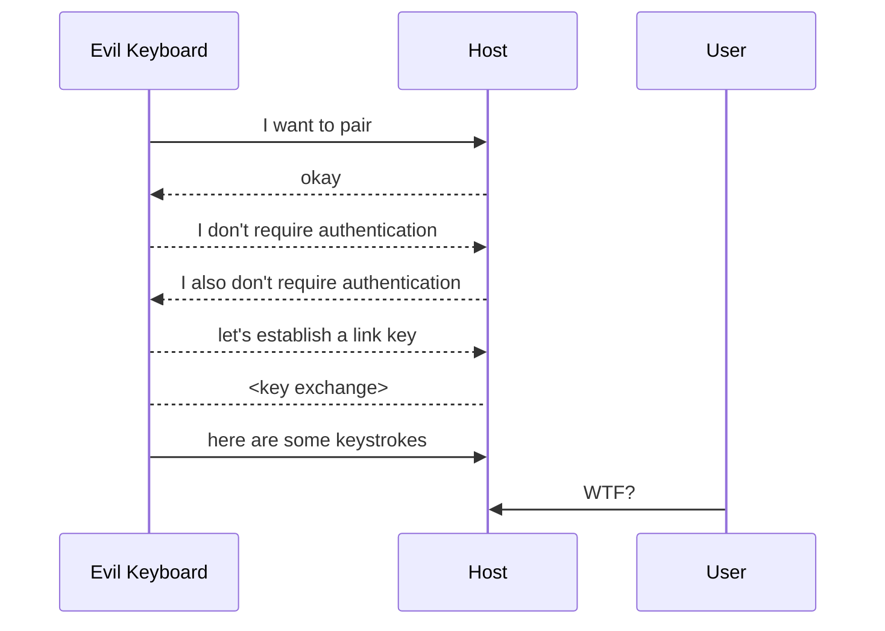

# Hi, My Name is Keyboard

Bluetooth vulnerabilities in Android, Linux, macOS, iOS and Windows can be exploited to pair an emulated Bluetooth keyboard and inject keystrokes without user confirmation.

Vulnerabilities in the Magic Keyboard can be exploited to extract the Bluetooth link key via the Lightning port or unauthenticated Bluetooth.

(Proof-of-concept scripts will be released following my [ShmooCon talk](https://www.shmoocon.org/speakers/#hikeyboard) at ~3pm ET on January 13th.)

### CVE-2024-0230

The Magic Keyboard <-> Mac pairing process can be exploited to extract the Bluetooth link key from a Magic Keyboard via unauthenticated Bluetooth or the Lightning port. If Lockdown Mode is not enabled, the link key can also be read from the paired Mac over USB.

The Magic Keyboard link key can be read:

- via the Lightning port if the keyboard has not been powered off since the last time it was plugged into the Mac

- via unauthenticated Bluetooth when the keyboard gets unplugged from its Mac

- via the USB port on the paired Mac (if Lockdown Mode is not enabled)

#### Known Affected Versions

*NOTE: Firmware updates for the Magic Keyboard were observed rolling out on 2023-01-09. A cursory evaluation was performed, and it appears that Apple has mitigated the CVE-2024-0230 attacks which exploit the Magic Keyboard over Lightning and Bluetooth. This section will be updated when more details are available.*

Apple security release: [Magic Keyboard Firmware Update 2.0.6](https://support.apple.com/en-us/HT214050)

| | | | | |
|-|-|-|-|-|
| macOS | 12, 13, 14 | CVE-2024-0230 | USB | (fix details pending) |
| Magic Keyboard | A2449 | CVE-2024-0230 | Lightning, Bluetooth | (fix details pending) |
| Magic Keyboard | A2450 | CVE-2024-0230 | Lightning, Bluetooth | (fix details pending) |
| Magic Keyboard | A2520 | CVE-2024-0230 | Lightning, Bluetooth | (fix details pending) |
| Magic Keyboard | A1843 | CVE-2024-0230 | Lightning, Bluetooth | (fix details pending) |
| Magic Mouse | A1657 | CVE-2024-0230 | Lightning, Bluetooth | (fix details pending) |

### CVE-2023-45866 and CVE-2024-21306

The Bluetooth stacks in multiple operating systems allow an attacker to pair a virtual Bluetooth keyboard without authentication or user confirmation. The attacker can then inject keystrokes to perform actions as the user, so long as those actions do not require password or biometric authentication.

- **Android** is vulnerable when Bluetooth is enabled
- **Linux/BlueZ** is vulnerable when Bluetooth is discoverable and connectable (typically when a 'Bluetooth settings' dialog is open)
- **macOS** and **iOS** are vulnerable when the host is connecting to a paired Magic Keyboard
- **Windows** is vulnerable when a Bluetooth keyboard has been paired with the computer, and the keyboard is powered off or out of range.

The Andriod vulnerability is zero-click, and unpatched devices can be exploited whenever Bluetooth is enabled.

The Linux vulnerability is zero-click, and unpatched hosts hosts can be exploited when they are discoverable and connectable over Bluetooth. Typically this occurs when the Bluetooth settings panel is open.

The macOS and iOS vulnerabilities are zero-click, but can only be exploited when the Mac or iPhone is attempting to connect to a paired Magic Keyboard. In practice, a Mac is exploitable when the user unplugs their Magic Keyboard after pairing or charging, and an iPhone is exploitable when the user is connecting to their paired Magic Keyboard.

The Windows vulnerability can be exploited if the user interacts with a malicious pairing request in any way (clicking accept, reject or close).

#### Known Affected Versions

|  |  |  |  |  |
|-|-|-|-|-|
| Android | 4.2, 5, 6, 7, 8, 9, 10 | CVE-2023-45866 | no fix available | Android 3 and earlier were not tested |
| Android | 11, 12, 13, 14 | CVE-2023-45866 | [fixed in 2023-12-05 security patch level](https://source.android.com/docs/security/bulletin/2023-12-01#2023-12-05-security-patch-level-vulnerability-details) |  |
| Linux (BlueZ) | [Affected Distros](#linux-distributions) | CVE-2023-45866 | [BlueZ patch available](https://git.kernel.org/pub/scm/bluetooth/bluez.git/commit/?id=25a471a83e02e1effb15d5a488b3f0085eaeb675) | |
| macOS | 12, 13 | CVE-2023-45866 | no fix available | macOS 11 and earlier were not tested |
| macOS | 14 | CVE-2023-45866 | [fixed in macOS 14.2](https://support.apple.com/en-us/HT214036) | |
| iOS | 16 | CVE-2023-45866 | no fix available | iOS 15 and earlier were not tested |
| iOS | 17 | CVE-2023-45866 | [fixed in iOS 17.2](https://support.apple.com/en-us/HT214035) |  |
| Windows | 10, 11, Server 2022 | CVE-2024-21306 | [fixed in January 2024 Patch Tuesday](https://msrc.microsoft.com/update-guide/en-US/advisory/CVE-2024-21306) | earlier versions of Windows were not tested |

## Crash Course in Bluetooth HID

This section provides a brief introduction to the some relevant Bluetooth HID concepts.

**H**uman **I**nterface **D**evices communicate by sending and receiving messages called **reports**.

- **Input** reports include keypresses and mouse movement/clicks
- **Output** reports include commands and state changes
- **Feature** reports are used by the host to read and write device settings

HID reports are transport agnostic, and can be received by the host over USB or Bluetooth.

Bluetooth HID devices communicate using **Bluetooth Classic L2CAP** sockets.

- L2CAP port 17 is the **HID Control** channel (feature reports, high latency)
- L2CAP port 19 is the **HID Interrupt** channel (input and output reports, low latency)

A Bluetooth HID link is considered established when both L2CAP ports are connected, so in general, if you can connect to L2CAP 17 and 19 on a host, you can inject keystrokes.

In order for a Bluetooth keyboard to connect to L2CAP 17 and 19, it needs to pair with the host.

- **Link Key** is used to encrypt the data sent between two Bluetooth devices
- **Pairing** establishes the link key
- **Bonding** saves the link key to the device
- **Out of Band Pairing** performs pairing and bonding over a non-Bluetooth channel like NFC or USB
- **Pairing Capability** defines the authentication mechanisms supported by a host or peripheral

### User Initiated Pairing Flow

Pairing is normally initiated when the user selects from a list of Bluetooth devices displayed on the host.

### Keyboard Initiated Pairing Flow

Pairing can also be initiated by the keyboard.

If the keyboard declares that it does not support authentication, we expect the host to reject the pairing attempt.

If the host accepted a pairing request without authentication, an attacker could pair a keyboard without the user's consent.

## Forced Pairing and Keystroke Injection

This section describes the keystroke-injection vulnerabilities affecting Android, Linux, macOS, iOS and Windows.

Vulnerable devices support keyboard-initiated pairing and do not require authenticated pairing. As a result, a keyboard (or emulated keyboard) can pair with a vulnerable device without user confirmation.

Forced pairing and keystroke injection are possible when the following criteria are met:

- the host is connectable/discoverable
- the host supports pairing without authentication via the `NoInputNoOutput` pairing capability
- the attacker can connect to L2CAP ports 17 and 19 on the host

On Linux and Android, L2CAP 17 and 19 are available whenever the host is discoverable.

On macOS, iOS and Windows, L2CAP 17 and 19 are only available to known peripherals (identified by Bluetooth address).

The Linux and Android attacks can be performed with ~any Bluetooth adapter, while the macOS, iOS and Windows attacks require a Broadcom-based Bluetooth adapter.

### Keystroke Injection Pairing Flow

## Magic Keyboard Link Key Extraction

This section describes vulnerabilities which can be exploited to extract the Bluetooth link key from a Magic Keyboard or its paired Mac.

###  Out-of-Band Pairing

Out-of-band pairing occurs over USB HID when the Magic Keyboard is plugged into to the Mac (and the connection is accepted if the Mac is in Lockdown Mode).

1. The Mac generates a random link key and stores it in the Keychain
2. The Mac sends the link key to the keyboard over USB, along with the Bluetooth address of the Mac
3. The keyboard stores the link key and Bluetooth address in memory
4. When the keyboard is unplugged from the Mac, it uses the address and link key to connect to the Mac over Bluetooth

### Unauthenticated Bluetooth HID Services

An unauthenticated Bluetooth HID service is available on the Magic Keyboard when the Bluetooth radio is powered on, persisting until the keyboard connects to the Mac via Bluetooth or Lightning/USB.

This occurs when the Magic Keyboard is switched on, and again when it is unplugged from the Mac.

An unauthenticated attacker can connect to the keyboard and send/receive HID messages as if the they were the paired Mac. This includes receiving keystrokes and reading/writing HID feature reports.

### Extracting the Link Key from the Lightning Port

After out-of-band pairing is performed, the link key remains in memory until the keyboard is switched off, so an attacker with physical access to the keyboard can extract the link key by connecting to the Lightning port and reading the appropriate HID report.

### Extracting the Link Key over Unauthenticated Bluetooth

When the Magic Keyboard is unplugged from the Mac, an attacker can connect to the unauthenticated Bluetooth HID services and extract the link key by reading the appropriate HID report.

This attack depends on a race condition where the attacker must connect to the Bluetooth HID services on the Magic Keyboard before the keyboard connects to the Mac. In testing, the attacker wins the race approximately 50% of the time.

### Extracting the Link Key from the USB Port on the Mac

The first time the Magic Keyboard is plugged into the Mac, the Bluetooth daemon generates a random link key and sends it to the keyboard over USB. The next time the keyboard is plugged into the Mac, the Bluetooth daemon recognizes the keyboard using its serial number and Bluetooth address, and resends the original link key.

If an attacker knows the Bluetooth address and serial number of a Magic Keyboard paired with a Mac, they can spoof the Magic Keyboard and read the link key from the USB port on the Mac (which can be screen locked).

This attack is mitigated by Lockdown Mode on macOS.

### Pairing the Magic Keyboard to a Different Host

An attacker can pair the Magic Keyboard with a different computer by writing out-of-band pairing data over Lightning/USB or unauthenticated Bluetooth. After the OOB pairing data is written, the Magic Keyboard will connect to the attacker-configured host.

---

### Linux Distributions

This table lists patch details published by affected Linux distributions. It is not intended to be a complete list of distributions vulnerable to CVE-2023-45866.

| Distribution | Patch Information |
|-|-|
| Ubuntu | https://ubuntu.com/security/CVE-2023-45866 |
| Debian | https://security-tracker.debian.org/tracker/CVE-2023-45866 |
| Redhat | https://access.redhat.com/security/cve/cve-2023-45866 |
| Amazon Linux | https://explore.alas.aws.amazon.com/CVE-2023-45866.html |
| Fedora | https://lists.fedoraproject.org/archives/list/package-announce@lists.fedoraproject.org/message/77YQQS5FXPYE6WBBZO3REFIRAUJHERFA/ |
| Gentoo | https://bugs.gentoo.org/919383 |
| Arch | https://gitlab.archlinux.org/archlinux/packaging/packages/bluez/-/commit/47e9592b1b322c54bdb094238f52fa20513c624b |
| OpenEmbedded | https://git.openembedded.org/openembedded-core/commit/?h=kirkstone&id=f03cb448574a730d85ed6d80bb58561674005ede |
| Yocto | https://patchwork.yoctoproject.org/project/oe-core/patch/20231208114435.416415-1-archana.polampalli@windriver.com/ |
| NixOS | https://github.com/NixOS/nixpkgs/blob/3dda6d5ed56af34534dd4cdcdd85627df25aec55/pkgs/os-specific/linux/bluez/default.nix#L45-L50 |
